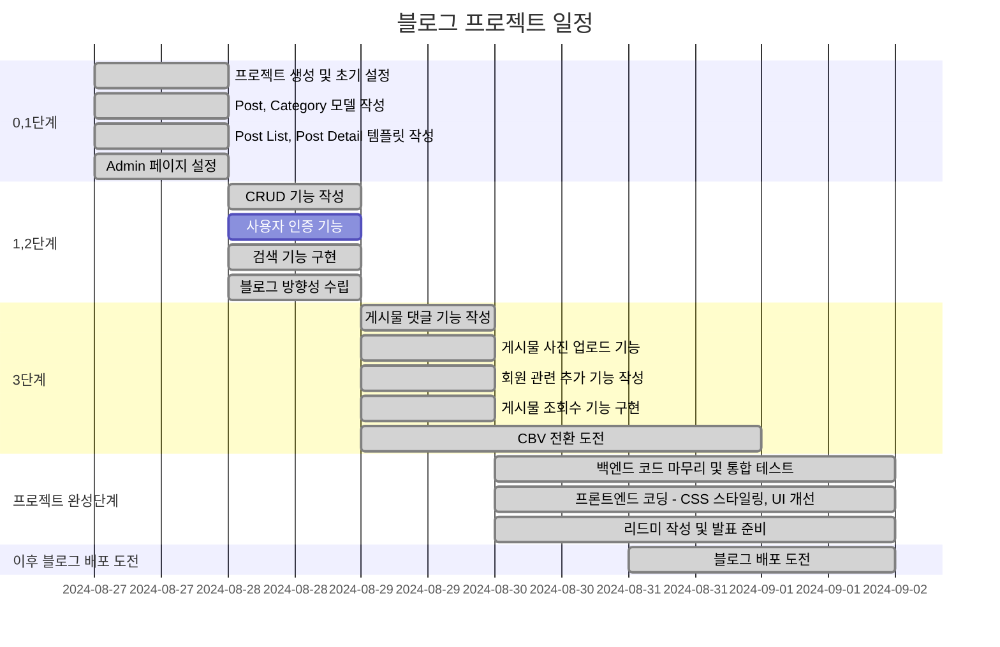

# django blog project

# WBS

```mermaid
gantt
    title 블로그 프로젝트 일정
    dateFormat  YYYY-MM-DD
    section 0,1단계
    프로젝트 생성 및 초기 설정       :done, 2024-08-27, 1d
    Post, Category 모델 작성 :done, 2024-08-27, 1d
    Post List, Post Detail 템플릿 작성 :done, 2024-08-27, 1d
    Admin 페이지 설정                 :done, 2024-08-27, 1d

    section 1,2단계
    CRUD 기능 작성                  :done, 2024-08-28, 1d
    사용자 인증 기능: 로그인/로그아웃/회원가입 :done, 2024-08-28, 1d
    검색 기능 구현                  :done, 2024-08-28, 1d
    블로그 방향성 수립 :done, 2024-08-28, 1d

    section 3단계
    게시물 댓글 기능 작성           :done, 2024-08-29, 1d
    게시물 사진 업로드 기능           :done, 2024-08-29, 1d
    회원 관련 추가 기능 작성        :done, 2024-08-29, 1d
    게시물 조회수 기능 구현          :done, 2024-08-29, 1d
    CBV 전환 도전                   :done, 2024-08-29, 3d

    section 프로젝트 완성단계
    백엔드 코드 마무리 및 통합 테스트 :done, 2024-08-30, 3d
    프론트엔드 코딩 - CSS 스타일링, UI 개선 :done, 2024-08-30, 3d
    리드미 작성 및 발표 준비          :done, 2024-08-30, 3d

    section 이후 블로그 배포 도전
    블로그 배포 도전                :done, 2024-08-31, 2d
```

# ERD
# URLs
