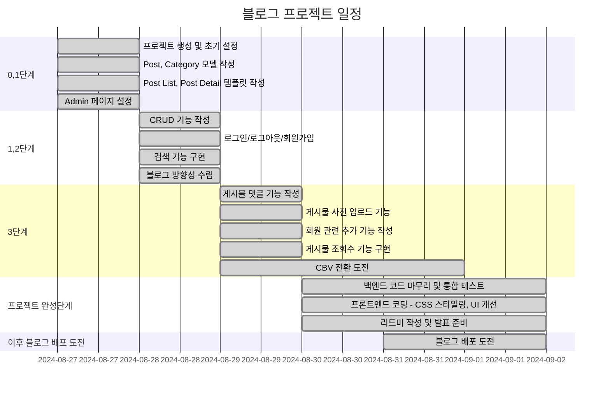
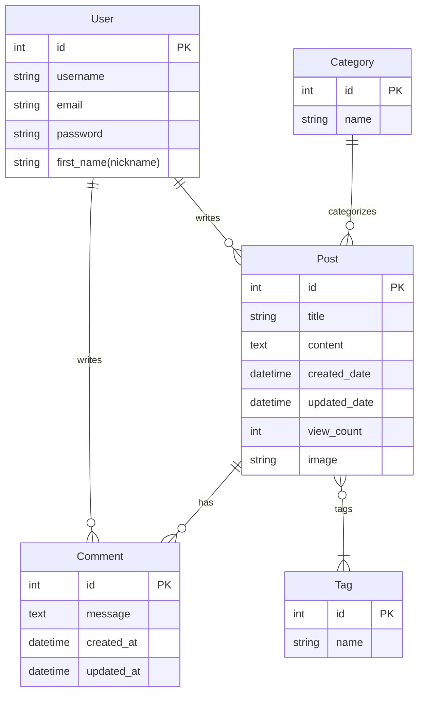

# django blog project

 Django를 이용하여 실제로 사용 가능한 Blog를 만들어보자.
 본 프로젝트에서는 다양한 사람이 자신이 좋아하는 게임에 관련된 이야기를 할 수 있는 페이지를 만들어 보자.

## WBS

## ERD

## URLs

|html 위치   | URL Pattern                       | View Name               | Description                                        |
|---------|-----------------------------------|-------------------------|----------------------------------------------------|
|blog    | `/`                               | `HomeView`              | 메인 페이지                                         |
|         | `/post/`                          | `PostListView`          | 게시물 목록                                         |
|         | `/post/tag-search`                | `TagSearchView`         | 태그별 검색                                         |
|         | `/post/<int:pk>/`                 | `PostDetailView`        | 게시물 상세                                         |
|         | `/post/new/`                      | `PostCreateView`        | 게시물 작성                                         |
|         | `/post/<int:pk>/edit/`            | `PostEditView`          | 게시물 수정                                         |
|         | `/post/<int:pk>/delete/`          | `PostDeleteView`        | 게시물 삭제                                         |
|         | `/post/<int:pk>/comment_delete/`  | `CommentDeleteView`     | 댓글 삭제                                           |
|         | `/post-not-found/`                | `PostNotFoundView`      | 게시물을 찾을 수 없는 경우 표시                      |
|accounts| `/signup/`                        | `UserSignupView`        | 회원가입                                            |
|         | `/login/`                         | `UserLoginView`         | 로그인 페이지                                       |
|         | `/logout/`                        | `UserLogoutView`        | 로그아웃                                            |
|         | `/profile/`                       | `UserProfileView`       | 유저 프로필                                         |
|         | `/profile/update/`                | `UserProfileUpdateView` | 프로필 정보 수정                                    |
|         | `/profile/pass_update/`           | `UserPassUpdateView`    | 비밀번호 변경                                       |

## 기능

